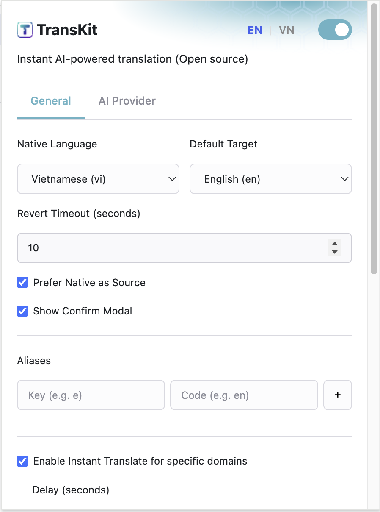

# TransKit

**TransKit** is a Chrome extension that brings instant, AI-powered translation directly to your input fields. No more switching tabs or copy-pasting—just type, command, and translate.


## Features

- **Instant Translation**: Type `!!<lang>` or `!!t` after your text to translate instantly
- **Instant Domain Mode**: Auto-translate on specific domains (chat apps, AI assistants) with inline suggestions
- **Smart Language Detection**: Automatically detects source language
- **Customizable Aliases**: Create shortcuts for your most-used languages
- **Non-blocking UI**: Continue working while translations process
- **Keyboard Shortcuts**: Quick actions with Tab and Esc keys
- **Privacy-First**: All processing happens locally using Chrome's built-in AI

## Installation

Currently, TransKit is available for installation via "Load Unpacked" for developers and early adopters.

1.  **Clone the repository**:
    ```bash
    git clone http://github.com/fernnguyen/transkit.git
    ```
2.  **Open Chrome Extensions**:
    - Navigate to `chrome://extensions/` in your browser.
3.  **Enable Developer Mode**:
    - Toggle the "Developer mode" switch in the top right corner.
4.  **Load Unpacked**:
    - Click "Load unpacked" and select the directory where you cloned the repository.

> [!IMPORTANT]
> This extension relies on Chrome's built-in AI APIs (`window.ai`). Ensure you are using a compatible version of Chrome (Canary or Dev channel may be required) and have enabled the necessary flags for "Prompt API for Gemini Nano" and "Language Detection API".

## Usage

### Manual Translation Mode

Type your text in any input field, then add the translation command:

```
Hello, how are you? !!vi
→ Xin chào, bạn khỏe không?

Tôi đang học tiếng Anh !!en
→ I am learning English

Quick translate to default target: !!t
```

### Instant Domain Translation Mode

Enable in settings for automatic translation on specific domains (Telegram, Discord, ChatGPT, etc.):


1. Open extension popup
2. Enable "Instant Translate for specific domains"
3. Configure delay (default: 3 seconds)
4. Manage domains and their popup position (top/bottom)
5. Visit an enabled domain and start typing

**How it works:**
- Type your message normally
- Wait for configured delay (no need to add `!!`)
- Inline suggestion appears below/above input
- Press **Tab** to apply translation
- Press **Esc** to dismiss
- Press **Delete/Backspace** to dismiss and edit

### Keyboard Shortcuts

- **Tab**: Apply suggested translation
- **Esc**: Dismiss suggestion
- **Delete/Backspace**: Dismiss and continue editing

## Configuration

Open the extension popup to customize:

<p align="center">
  
  
</p>


- **Enable/Disable Extension**: Toggle the extension on/off
- **Native Language**: Your primary language
- **Default Target Language**: Language to translate to when using `!!t`
- **Revert Timeout**: How long to show the confirmation dialog
- **Prefer Native as Source**: Use native language as default source
- **Show Confirm Modal**: Display confirmation before applying translation
- **Custom Aliases**: Create shortcuts (e.g., `e` → `en`, `v` → `vi`)

### Instant Translate Settings

- **Enable Instant Translate**: Turn on auto-translation for specific domains
- **Delay**: Time to wait before translating (1-10 seconds)
- **Active Domains**: Manage domains with enable/disable toggles
- **Position**: Choose popup position (top/bottom) per domain
- **Add Custom Domain**: Add your own domains to the list

**Default Domains:**
- telegram.org (top)
- discord.com (top)
- zalo.me (top)
- openai.com (top)
- claude.ai (top)
- gemini.google.com (top)

## License

This project is licensed under the MIT License.
